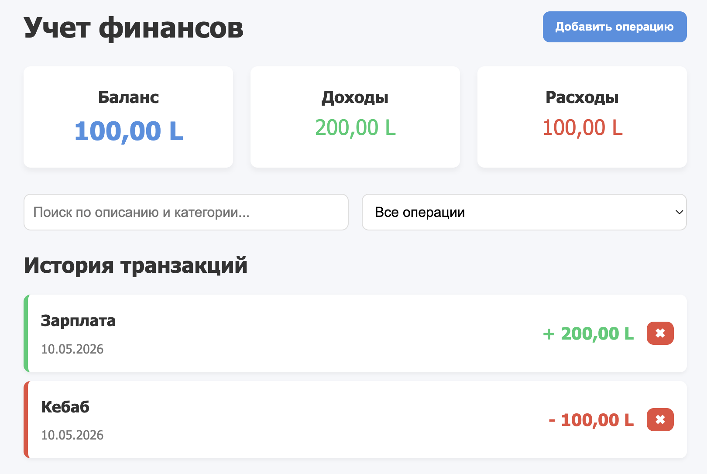
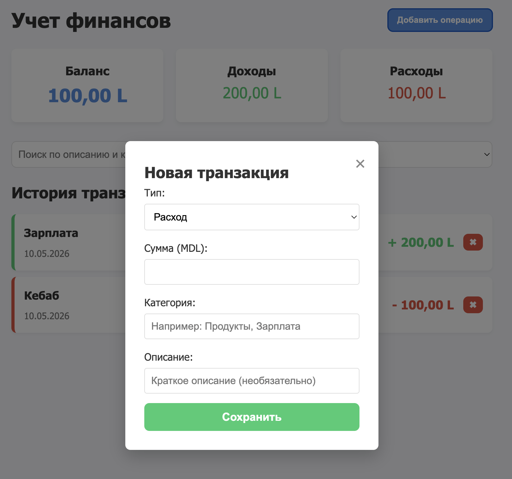
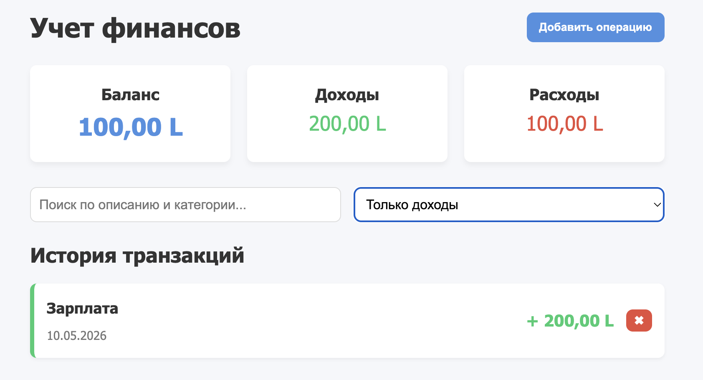

# Индивидуальный проект. Учет личных финансов

Автор: Stan Bogdan, IAFR2503 R

## Описание проекта

Для индивидуального проекта я сделал небольшое веб-приложение для учета личных финансов. В нем можно добавлять доходы и расходы, смотреть общий баланс, фильтровать операции и удалять ошибочно добавленные записи.

Проект написан на чистом JavaScript без фреймворков. Данные сохраняются в `localStorage`, поэтому после обновления страницы список операций не пропадает.

## Инструкции по запуску

Проект использует ES6-модули, поэтому его нужно открыть через локальный сервер.

1. Открыть папку `LI` в VS Code.
2. Запустить `index.html` через расширение Live Server.
3. Нажать `Go Live`.

## Основные функции

- добавление дохода или расхода через модальное окно;
- проверка суммы и категории перед сохранением;
- отображение общего баланса, доходов и расходов;
- удаление операции с подтверждением;
- поиск по категории и описанию;
- фильтр по типу операции;
- сохранение данных в браузере через `localStorage`.

## Пример использования

1. Нажать кнопку добавления операции.
2. Выбрать тип: доход или расход.
3. Ввести сумму, категорию и описание.
4. Сохранить операцию.

Например, можно добавить расход:

```text
Тип: expense
Сумма: 120
Категория: Food
Описание: lunch at university
```

После добавления операция появится в списке, а блок с балансом пересчитается автоматически.

## Скриншоты для отчета

Главная страница с балансом и списком операций:



Окно добавления новой операции:



Пример работы фильтра:



## Структура проекта

- `src/index.js` запускает приложение после загрузки страницы;
- `src/app.js` содержит основную логику: модальное окно, форма, фильтры;
- `src/storage.js` отвечает за работу с `localStorage`;
- `src/ui.js` отвечает за отрисовку списка и обновление баланса;
- `style.css` содержит стили страницы.

## Что было сложнее всего

Самым неудобным моментом было связать фильтрацию, удаление и обновление баланса так, чтобы после любого действия интерфейс сразу показывал актуальные данные. Для этого я сделал отдельную функцию обновления вида и вызываю ее после изменений.

## Источники

- Материалы курса MSU Courses: JavaScript
- MDN Web Docs: https://developer.mozilla.org/ru/docs/Web/API/Window/localStorage
- MDN Web Docs: https://developer.mozilla.org/ru/docs/Web/API/Document_Object_Model
- MDN Web Docs: https://developer.mozilla.org/ru/docs/Web/JavaScript/Guide/Modules
