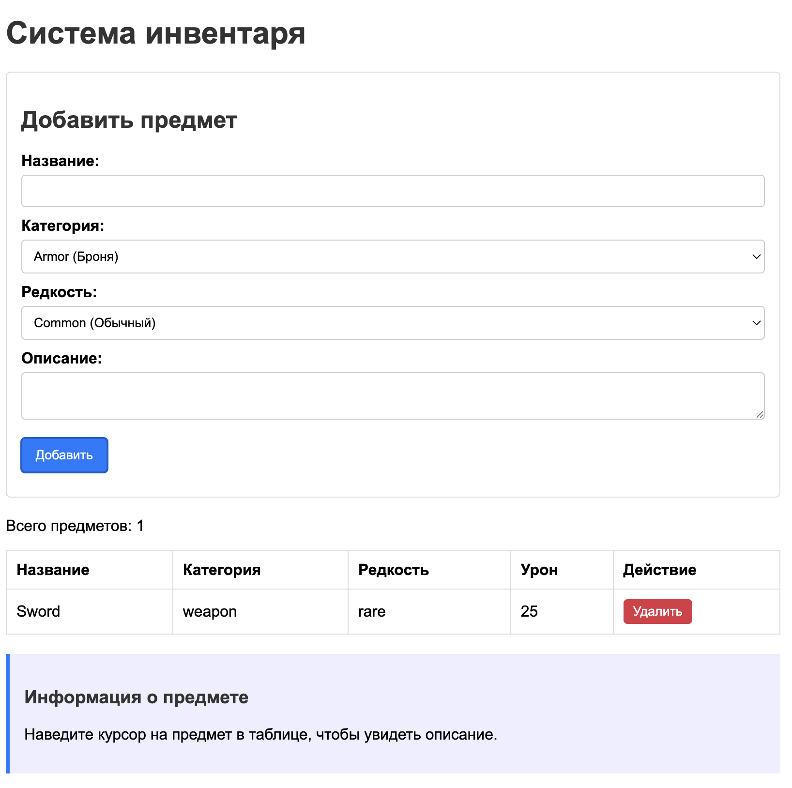
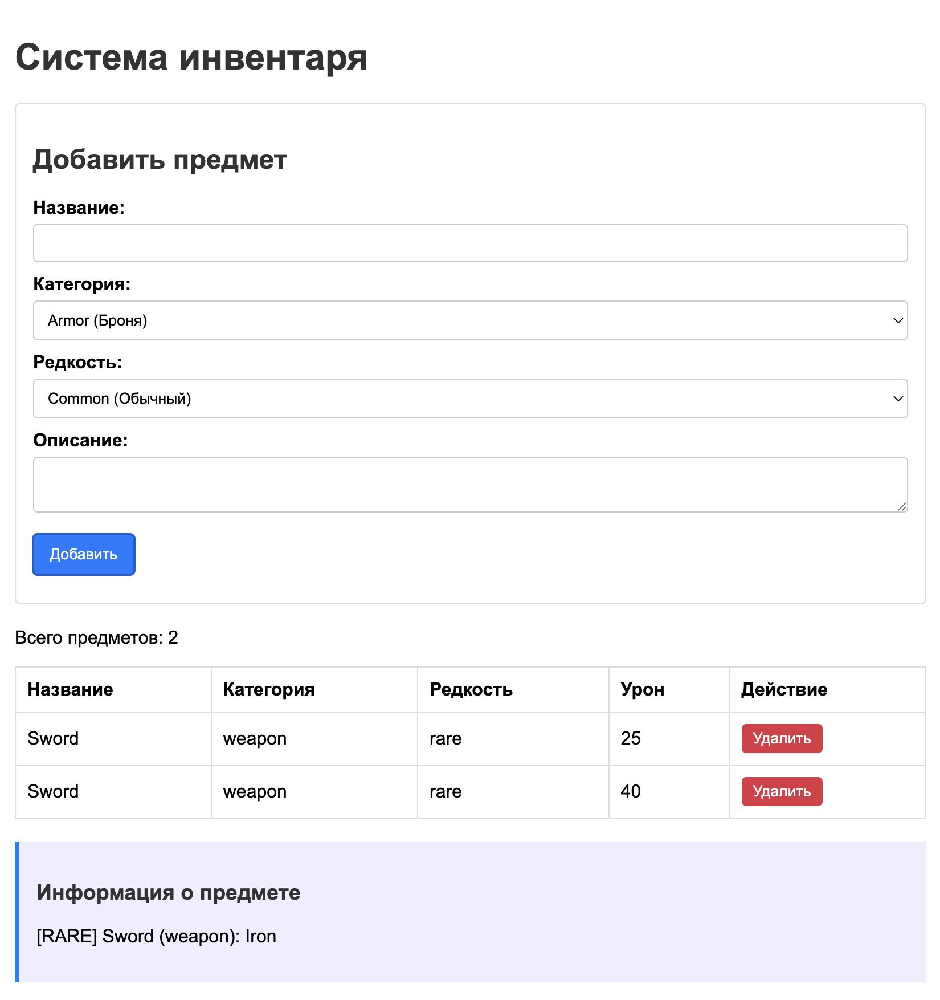

# Лабораторная работа №5. Работа с DOM-деревом и событиями

Автор: Stan Bogdan, IAFR2503 R

Вариант 2: система инвентаря

## Описание работы

В этой лабораторной я сделал страницу для управления инвентарем. Через форму можно добавить предмет, выбрать категорию и редкость, указать описание. Если это оружие, появляется отдельное поле для урона.

Предметы добавляются в таблицу без перезагрузки страницы. Их можно удалять кнопкой в строке. Еще при наведении на строку показывается подробная информация о предмете.

## Инструкции по запуску

Проект использует ES6-модули, поэтому его нужно открыть через локальный сервер.

1. Открыть папку `LL_05` в VS Code.
2. Запустить `index.html` через расширение Live Server.
3. Нажать `Go Live`.

## Что было сделано

- создана форма добавления предмета;
- создана таблица для отображения инвентаря;
- код разделен на модули `classes.js`, `inventory.js`, `utils.js`, `ui.js`, `index.js`;
- реализованы классы `Item` и `Weapon`;
- добавлена валидация формы;
- реализовано удаление через делегирование событий;
- добавлен подсчет общего количества предметов;
- при наведении на строку показывается описание;
- при удалении строка плавно исчезает.

## Пример использования

1. В поле названия ввести `Steel Sword`.
2. В категории выбрать `weapon`.
3. Указать редкость `rare`.
4. Ввести урон, например `25`.
5. Добавить описание.
6. Нажать кнопку добавления.

После этого предмет появится в таблице. В колонке урона будет `25`, а в консоль выведется сообщение метода `attack()`.

Для обычного предмета, например брони или зелья, в колонке урона будет стоять прочерк.

## Скриншоты для отчета

Таблица после добавления предмета:



Блок с подробной информацией о предмете:



## Краткая документация

- `src/classes.js` содержит классы `Item` и `Weapon`;
- `src/inventory.js` хранит массив предметов и функции для работы с ним;
- `src/utils.js` содержит вспомогательные функции, например генерацию id;
- `src/ui.js` отвечает за таблицу, счетчик и события;
- `src/index.js` связывает форму с логикой приложения.

## Ответы на контрольные вопросы

1. Каким образом можно получить доступ к элементу на веб-странице с помощью JavaScript?

Самые удобные способы:

```js
document.getElementById("id");
document.querySelector(".class");
document.querySelectorAll("button");
```

В работе я чаще использовал `querySelector`, потому что он принимает обычный CSS-селектор.

2. Что такое делегирование событий?

Делегирование событий - это когда обработчик ставится не на каждый элемент отдельно, а на общего родителя. В моей работе обработчик клика находится на таблице. Когда нажимается кнопка удаления, событие поднимается до таблицы, а дальше код проверяет `event.target`.

Так не нужно заново навешивать обработчик на каждую новую строку.

3. Как можно изменить содержимое элемента DOM?

Можно использовать `textContent`, если нужно поменять только текст:

```js
element.textContent = "Новый текст";
```

Если нужно вставить HTML-разметку, можно использовать `innerHTML`, но с ним нужно быть осторожным, особенно если данные вводит пользователь.

4. Как можно добавить новый элемент в DOM-дерево?

Обычно элемент создается через `document.createElement`, затем ему задаются данные, после чего он добавляется через `append` или `appendChild`.

Пример:

```js
const row = document.createElement("tr");
tableBody.appendChild(row);
```

## Источники

- Материалы курса MSU Courses: JavaScript
- MDN Web Docs: https://developer.mozilla.org/ru/docs/Web/API/Document_Object_Model
- MDN Web Docs: https://developer.mozilla.org/ru/docs/Web/JavaScript/Guide/Modules
